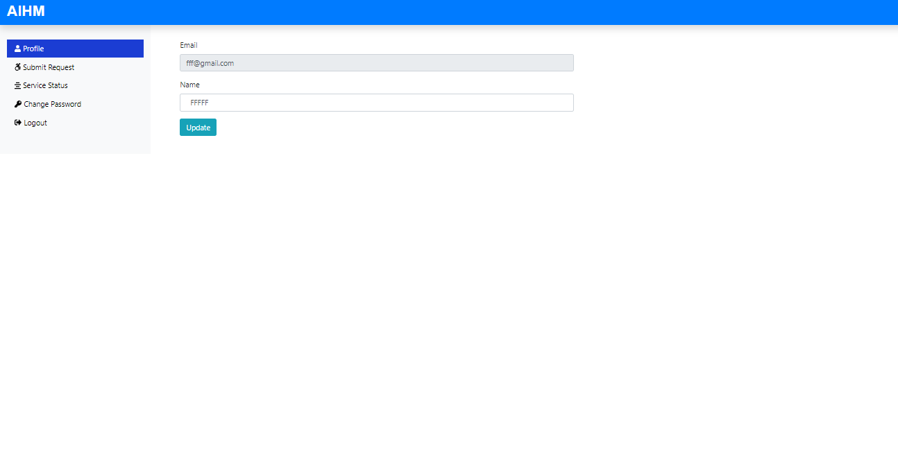

# Automation-In-Hospital-Management
This website is used for hospital management. In this website admin and requester both can login through their id and admin can assign the service demanded by requester.

# Key features
✔️ Different logins for requesters/admins,
✔️ New doctor/patients can be added,
✔️ Patient can contact easily with the contact info,
✔️ List of the doctors/patients can be easily available,
✔️ Admin can assign appointment to the patient according to their request id,
✔️ Data of admin and requester will be stored in database,
✔️ Medicine/Other medical instruments can be purchased.

# Languages used
✔️ HTML
✔️ CSS
✔️ Javascript
✔️ Bootstrap
✔️ SQL 
✔️ PHP(Core+Advanced)

# Tools/Software Used
✔️ Visual Studio Code/Brackets Code Editor
✔️ XAMPP

# Browser
✔️ Chrome

# ScreenShots

